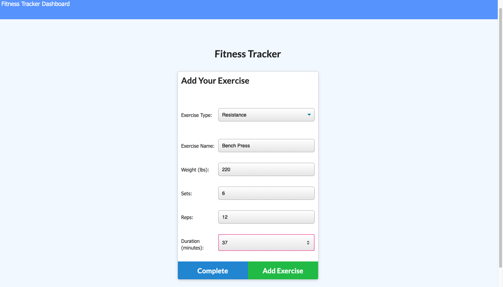
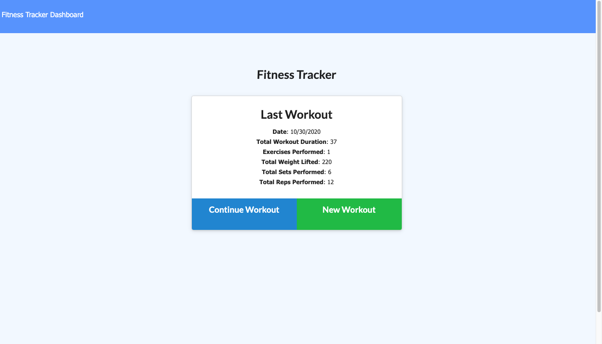
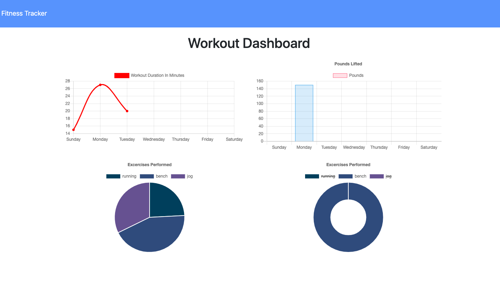

# Fitness-Tracker

## Description 

Fitness-tracker is an application where you are able to view and add workouts. This application was created using Node, Express, MongoDB, and more. You are able to see your last recorded workout and either create a new workout, or add to your last workout. To add your workout, you can choose between cardio or resistence. Then, you will be able to input the rest of your workout details and add it to your tracker. All your information will be stored in a database using MongoDB. Lastly, You are able to see your workouts tracked in a variety of different charts.

## Table of Contents (Optional)

* [Installation](#installation)
* [Usage](#usage)
* [Contributing](#Contributing)
* [License](#license)

## Installation

To install use the following command: 
<pre><code>npm i</pre></code>
-To add a workout:

-Last workout:

-Stats charted:

## Usage 

Run: <pre><code>node server.js</pre></code> 

## License

## Contributing

Contributions in the form of issues and pull requests are welcomed and encouraged.

